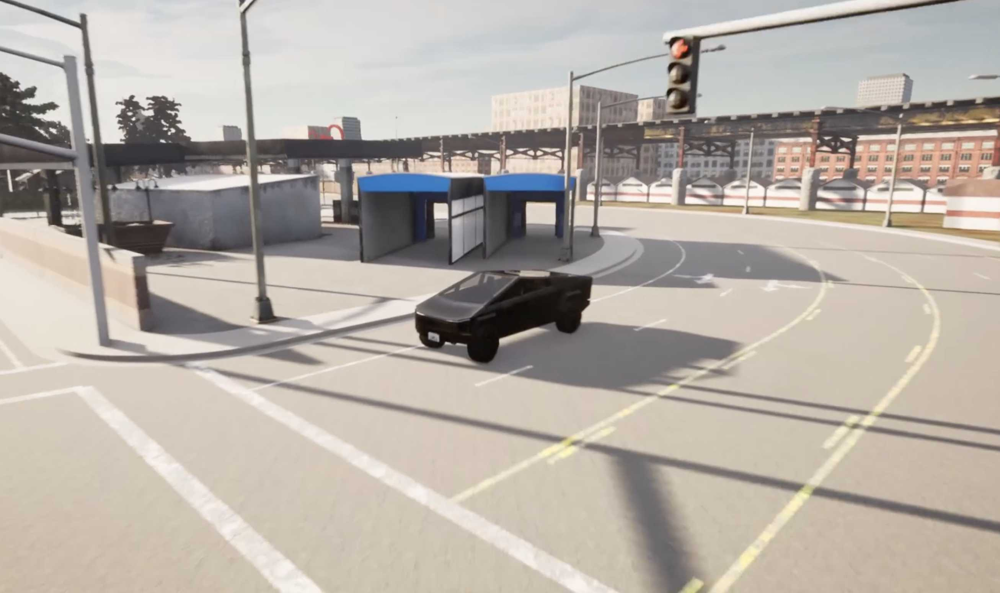
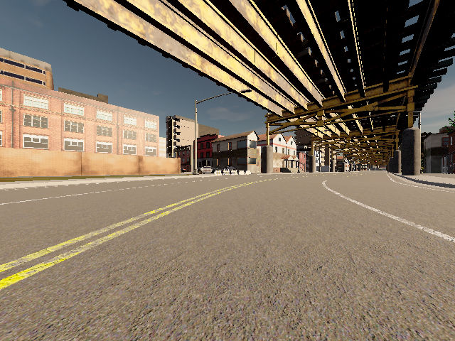
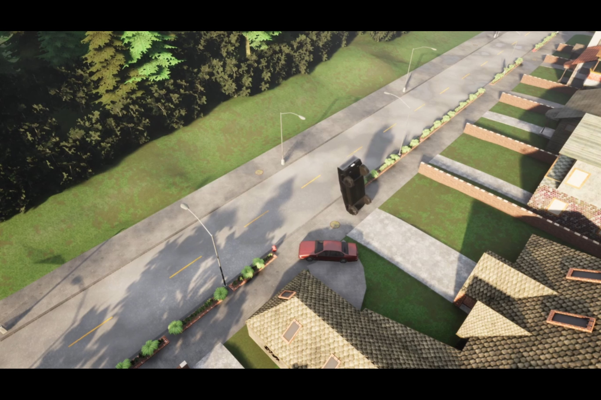
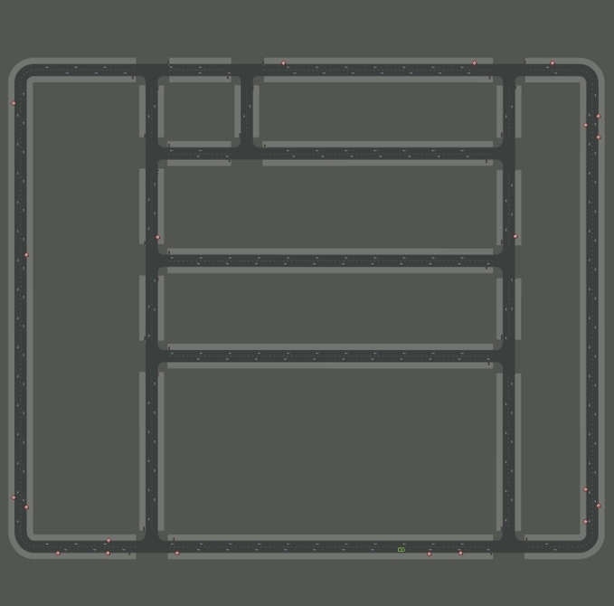
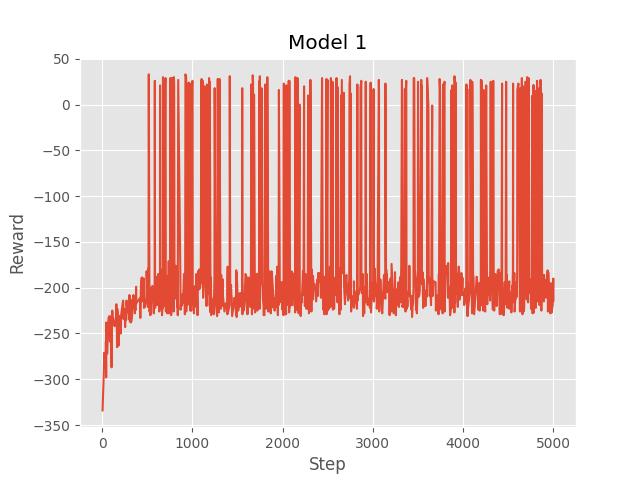
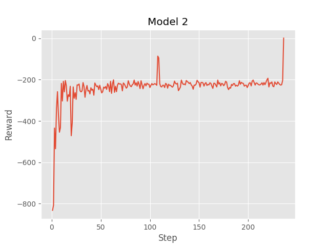
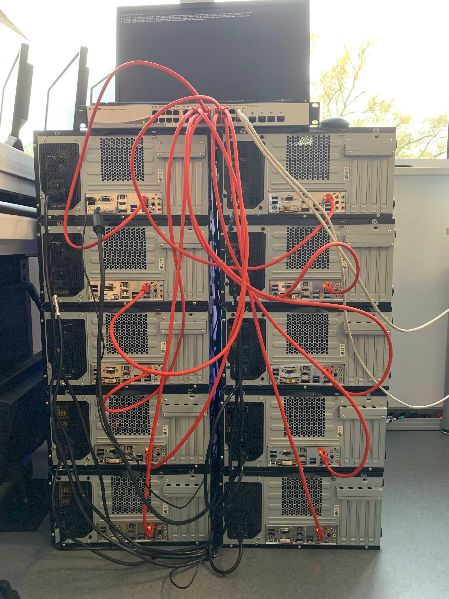

# AI Cars

> Enable cars to drive autonomously in a simulation using Deep Reinforcement Learning.

## Table of Contents

* [Introduction](#introduction)
* [Training](#training)
* [Evaluation](#evaluation)
* [Screenshots](#screenshots)
* [Dependencies](#dependencies)
* [Acknowledgements](#acknowledgements)

## Introduction

- Carla offers the simulation environment with API
- Multiple agents (cars) are learning simultaneously
- An attached camera serves as input
- The agents can execute three actions (steer left/right, accelerate)
- They receive a positive reward for remaining speed and avoiding collisions

## Training

- Training was parallelized on multiple nodes
- Self-coded management software for synchronisation between nodes
- Central mainframe distributes scripts and collects results

## Evaluation

- Model 1 (Xception)
    - 30 million trainable parameters
    - way too big neural network
    - massive over-fitting
- Model 2 (Sequential with convolution & pooling layers)
    - 3 million trainable parameters
    - usable results
    - actually learning

## Screenshots

 
*Every agent controls a Cybertruck*

 
*View of the agent through the attached camera*

 
*An interesting situation during training*

 
*Small carla map (for testing only)*

 
*Bigger carla map (used for training)*

 
*Results of model 1*

 
*Results of model 2*

 
*Self-build computing cluster*

## Dependencies

- [Carla](https://carla.org)
- [TensorFlow](https://www.tensorflow.org)
- cv2
- numpy

## Acknowledgements

This project was based on a tutorial
by [Sentdex](https://pythonprogramming.net/introduction-self-driving-autonomous-cars-carla-python/).

*Original idea in September 2021*
